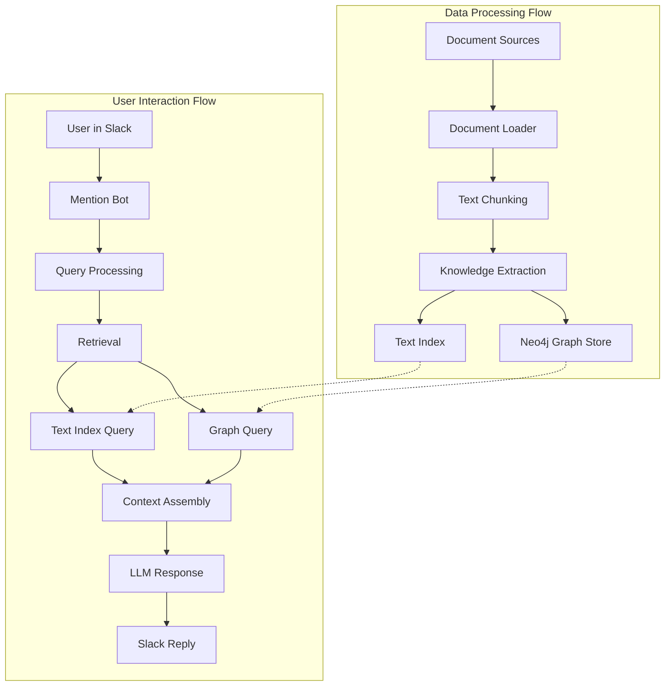

# GraphRAG

A knowledge graph-based RAG (Retrieval-Augmented Generation) system with Slack integration.

## Features

- Document processing and knowledge extraction
- Neo4j-based knowledge graph storage
- Community detection and summarization
- Slack bot integration for querying
- Async processing support

## Setup

1. Clone the repository
2. Copy .env.example to .env and configure your environment variables
3. Install dependencies:
   ```bash
   poetry install
   ```
4. Start Neo4j database
5. Run the application:
   ```bash
   poetry run python src/main.py
   ```

## Architecture

- Core components for knowledge graph operations
- Slack integration for user interaction
- Modular design for easy extension
- Async processing for better performance


